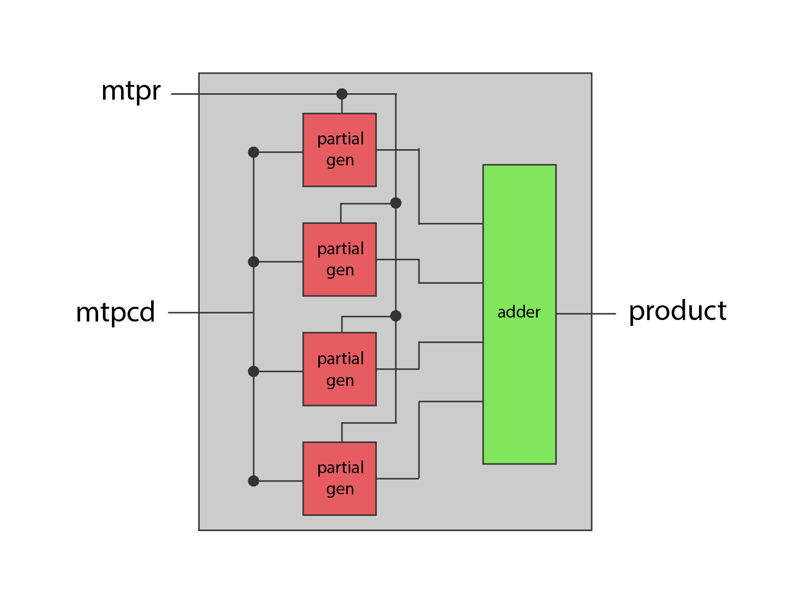
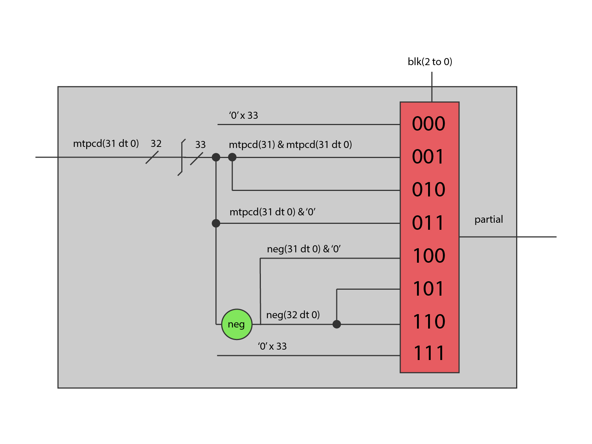

# CNN Accelerator

In this repository, you will find the hardware design for a Convolutional Neural Network (CNN) accelerator described in VHDL. It multiplies a 32-bit integer with a 7-bit constant from a 3x3 kernel and accumulates the results.

## The multiplier

The multiplier uses a parallel approach of the radix-4 Booth's algorithm. In this case, the 7-bit constant is used as the multiplier to generate only 4 partial products. Firstly, the architecture should use a wallace tree to sum the partial products. However, with only two levels, it was decided to use a four way adder that uses a 4:2 compressor internally to reduce the size of the circuit.

<p align="center">
    
    <p>Figure 1</p>
</p>

As seen in figure 1, the multiplier has 4 components responsible for generating the partial products and a 4-way adder to sum them. Inside the partial product generator, the Booth's algorithm is implemented as follows figure 2. The multiplexer is used to select the value of the partial product based on the value of block made by part of the multiplier number.

<p align="center">
    
    <p>Figure 2</p>
</p>

The partials products are generated by the following the radix-4 table:

| Operation  | Block |
|------------|-------|
| mtpcd * 0  | 000   |
| mtpcd * 1  | 001   |
| mtpcd * 1  | 010   |
| mtpcd * 2  | 011   |
| mtpcd * -2 | 100   |
| mtpcd * -1 | 101   |
| mtpcd * -1 | 110   |
| mtpcd * 0  | 111   |

Also, the multiplexer only has 33 bits because the extension of the signal is only necessary when summing the partial products. When extending the signal, is also made the shift to the left to align the bits in Booth's algorithm.

The 4-way adder is implemented with a 4:2 compressor chain. The chain was implemented as follows:

```vhdl
compressor_gen : for i in 0 to 38 generate
    p_carry(i) <= carry_bus(i) or c_out_bus(i);

    compressor_inst : compressor
        port map(
            b0    => a(i),
            b1    => b(i),
            b2    => c(i),
            b3    => d(i),
            c_in  => p_carry(i),
            c_out => c_out_bus(i + 1),
            carry => carry_bus(i + 1),
            sum   => sum(i)
        );

end generate compressor_gen;
```
